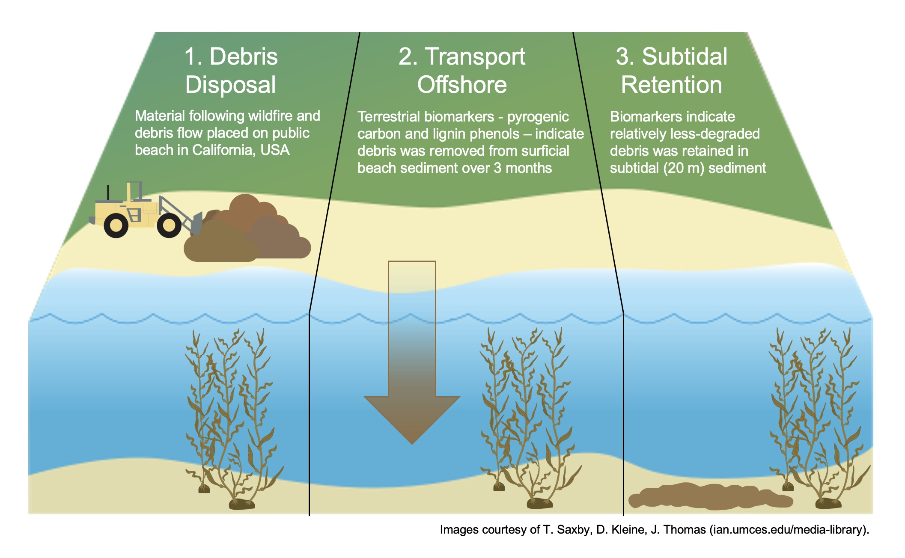

# coastal-debris-2022
Repository containing data and scripts for the following manuscript:

*Lowman, H.E., M. Moingt, A. Zimmerman, J.E. Dugan, J.M. Melack. Distribution of Terrestrial Organic Material in Intertidal and Nearshore Marine Sediment due to Debris Flow Emergency Response. Science of the Total Environment. https://doi.org/10.1016/j.scitotenv.2022.156886*

All data can be downloaded from the [Santa Barbara Coastal Long Term Ecological Research Program's data portal](https://sbclter.msi.ucsb.edu/data/catalog/package/?package=knb-lter-sbc.151).

For additional support or information regarding this project, please contact Heili at hlowman *at* unr.edu.

 
